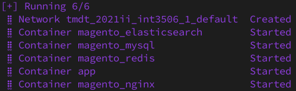
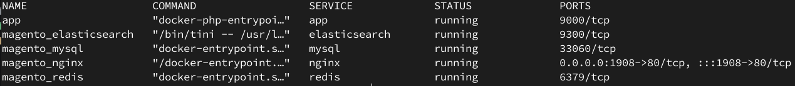
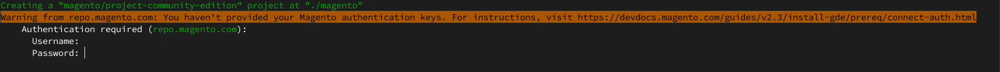

# Hướng dẫn sử dụng
Dự án hệ thống thương mại điện tử sử dụng Docker và Magento2

## Một số yêu cầu về phần cài đặt

- [Docker](https://docs.docker.com/engine/install)
- [Docker-compose](https://docs.docker.com/compose/)

## Docker

Các service mà sử dụng trong docker

    nginx
    php7.4-fpm
    mysql
    redis
    elasticsearch

Build docker bằng lệnh

```bash
docker-compose up --build
```

Chờ đợi docker-compose tải và cài đặt lại các container đến khi có kết quả như sau

Sử dụng ``Ctrl + C``` để thoát ra khỏi **service**

Sau đó thì chỉnh quyền của thư mục elasticsearch

```bash
sudo chown -R 1000:root data/elasticsearch/
```

Rồi compose-up lại
```bash
docker-compose up -d
```

Sau khi chạy sẽ hiện kết quả như sau




Để kiểm tra các container có hoạt động bình thường không thì dùng lệnh
```bash
docker-compose ps
```



Chú ý nếu có vấn đề gì thì có thể sử dụng lệnh dưới đây để kiểm tra lỗi và sửa

```
docker-compose logs
```

Để có thể truy cập **containter app** thì dùng lệnh sau
```bash
docker exec -it app bash
```

Tắt docker:
```bash
docker-compose down
```

---

## Magento

### Get Access keys

Trước hết phải lấy **Access keys** ở [theo hướng dẫn này](https://devdocs.magento.com/guides/v2.4/install-gde/prereq/connect-auth.html)

Khi đó

    user: Public Key
    password: Private Key

### Install Composer (Không yêu cầu)

```bash
# INSTALL COMPOSER
php -r "copy('https://getcomposer.org/installer', 'composer-setup.php');" && \
php composer-setup.php && php -r "unlink('composer-setup.php');"
```

Sau khi cài đặt composer có thể sử dụng các tính năng qua câu lệnh
```
php composer.phar
```

### Download Magento

```bash
php composer.phar create-project --repository=https://repo.magento.com/ magento/project-community-edition magento
```

Sử dụng **Access Keys** từ trên nhập vào theo yêu cầu




### Install Magento

1. Đầu tiên truy cập vào **app**
  ```bash
  docker exec -it app bash
  ```

  Thư mục hiện tại (Current Directory) sẽ là: **/var/www/**. Hãy chuyển đến thư mục magento vừa tải về

  ```bash
  cd magento
  ```

2. Setup mangeto với lệnh sau
  ```bash
  php bin/magento setup:install \
  --backend-frontname='admin' \
  --db-host=mysql \
  --db-name=magento2 \
  --db-user=root \
  --db-password=mysql_root_password \
  --admin-firstname={firstname} \
  --admin-lastname={lastname} \
  --admin-email={email} \
  --admin-user={usernaem} \
  --admin-password={password} \
  --language=en_US \
  --currency=VND \
  --timezone=Asia/Ho_Chi_Minh \
  --use-rewrites=1 \
  --search-engine=elasticsearch7 \
  --elasticsearch-host=elasticsearch \
  --elasticsearch-port=9200 \
  --cache-backend=redis \
  --cache-backend-redis-server=redis \
  --cache-backend-redis-port=6379 \
  --cleanup-database
  ```

  Có thể tùy chinh các phần nằm trong ```{}```

3. Sau khi cài xong tắt Magento_TwoFactorAuth đi để có thể đăng nhập mà không phải sử dụng bảo mật 2 lớp để truy cập vào tài khoản admin

  ```bash
  php bin/magento module:disable Magento_TwoFactorAuth
  ```


4. Cài đặt cập nhật để Magento có thể chạy bình thường

  Update module
  ```bash
  php bin/magento setup:upgrade
  ```

  Compile source code
  ```bash
  php bin/magento setup:di:compile
  ```

  Generate static file
  ```bash
  php bin/magento setup:static-content:deploy -f
  ```

  Chuyển quyền cho file **var/** và **generated/**
  ```bash
  chmod -R 777 var/ generated/ pub
  ```

### Using

- Truy cập **localhost:1908** để truy cập vào trang chủ của ứng dụng

- Sử dụng lệnh
  ```bash
  php bin/magento info:adminuri
  ```
  Kết quả sẽ là phần url của quản trị viên ```<adminurl>```.

  Truy cập ```localhost:1908/<adminurl>``` để truy cập vào trang đăng nhập quản trị admin.

  Sau khi truy cập vào đương link trang đăng nhập quản trị của admin thì sử dụng thông tin đã đăng ký từ trước trong khi cài đặt magento để đăng nhập vào.


### Add modules

Truy cập vào **app**

```bash
docker exec -it app bash
```

Copy thư mục extensions trong src vào magento

```bash
# root@..... /var/www#
cp -r extensions/* magento
```

Cập nhật lại các module

```bash
php bin/magento setup:upgrade
php bin/magento setup:di:compile
php bin/magento setup:static-content:deploy
```

### Một số hướng dẫn thêm

[Cài đặt theme cho Magento 2](https://www.mageworx.com/blog/how-to-install-a-theme-in-magento-2)

[Một số hướng dẫn cơ bản của Magento 2](https://devdocs.magento.com/videos/fundamentals/)

[Một số tài liệu thêm có thể tìm thấy ở trong phần Tài liệu](https://github.com/inFngNam/2021II_INT3506_1/tree/main/T%C3%A0i%20li%E1%BB%87u)

### Thành viên trong nhóm

1. Nguyễn Văn Nam - 18020920
2. Lê Thị Tâm - 18021118
3. Nguyễn Thị Xuân - 18021451


